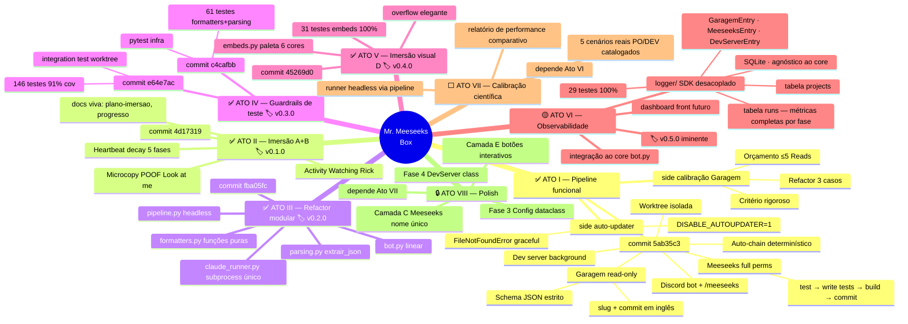
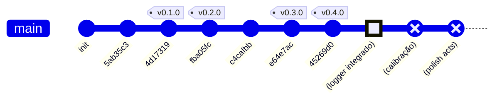

# Árvore do projeto

Visualização do caminho percorrido + próximos passos. Atos concluídos
ficam verdes, o atual amarelo, os próximos cinza (e cinza opaco quando
bloqueados por dependência).

## Como visualizar

Em ordem de fricção (menor → maior):

1. **VSCode + extensão "Markdown Preview Mermaid Support"**
   (`bierner.markdown-mermaid`) — grátis, oficial. Abre este `.md` e
   dá `Ctrl+Shift+V` pro preview lateral.
2. **GitHub** renderiza `.md` com Mermaid nativamente.
3. **[mermaid.live](https://mermaid.live)** — cola o bloco, vê na hora.
4. **Obsidian / Notion / Confluence** — renderizam nativo.

## Legenda

| Cor | Símbolo | Significado |
|---|---|---|
| 🟢 verde | ✅ | Ato concluído, em produção, smoke testado |
| 🟡 amarelo | 🟡 | Ato em curso (você está aqui) |
| ⬜ cinza | ⬜ | Próximo ato, escopo definido mas não iniciado |
| 🔒 cinza apagado | 🔒 | Ato bloqueado por dependência ou decisão externa |

---

## Mindmap — árvore conceitual

Cada nó central é um **ato** do projeto. Os filhos detalham o conteúdo.
Atos pintados conforme a legenda acima.



---

## gitGraph — timeline de commits e tags

Espelha o `git log` real, com tags marcando os marcos. Estende com
**bolinhas previstas** pros próximos atos — texto em parênteses
indica que ainda não existem no histórico.



> Bolinhas tipo **HIGHLIGHT** (Camada D) já foram produzidas mas estão
> pendentes de commit/tag. Bolinhas tipo **REVERSE** (visualmente
> vazadas) são previsões — ainda não existem.

---

## Onde estamos agora

```
PASSADO ━━━━━━━━━━━━━━━━━━━━━━━━━━━━━━━━━━ FUTURO
●━━●━━●━━●━━●━━●━━🟡 ┄┄┄ ⬜ ┄┄┄ 🔒
               ↑
          você está aqui
          Ato VI — logger SDK pronto
          falta integrar ao core + tag v0.5.0
```

## Próximos ramos a brotar

Atos VI e VII já estão no mindmap acima como nós cinza. Quando
entrarmos em cada um, vão amadurecendo pra amarelo (atual) e depois
verde (concluído). Este arquivo é vivo — atualizo a cada milestone.
