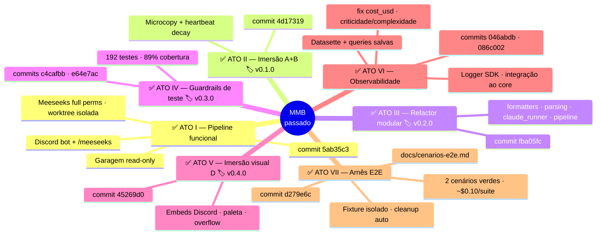
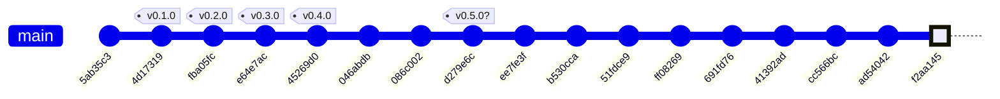
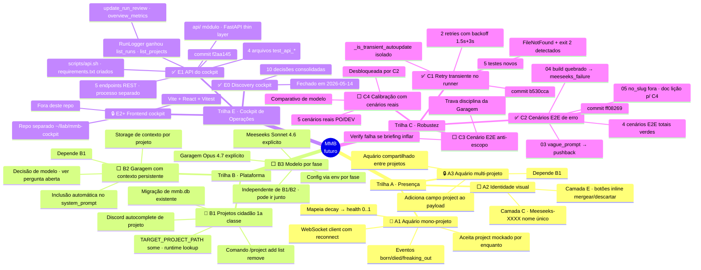
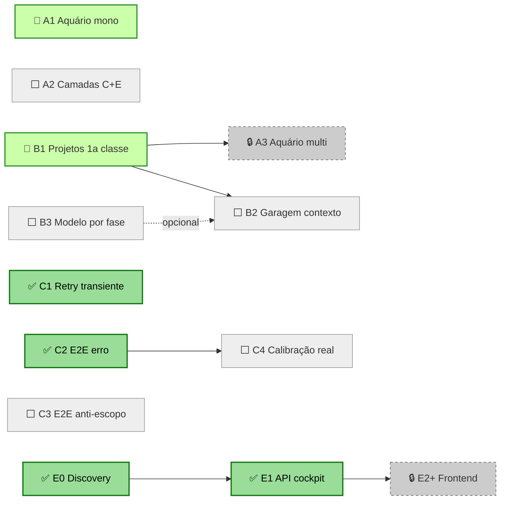

# Mr. Meeseeks Box — Plano

Mapa vivo. Norte de médio-longo prazo + decomposição em trilhas
paralelas + dependências explícitas. Atualizado a cada milestone.

## Visão

**Plataforma multi-projeto de execução determinística por agentes.**
O Rick lança uma tarefa em qualquer projeto cadastrado via Discord.
Uma Garagem com contexto persistente daquele projeto planeja; um
Meeseeks com identidade própria executa em worktree isolada; um
aquário ao vivo mostra todo Meeseeks em curso, em todos os projetos,
respirando até morrer feliz ou derrotado. Tudo gravado em SQLite,
calibrável por modelo (Opus na decisão, Sonnet na execução),
auditável retroativamente e reproduzível via cenários E2E.

A versão final deve dar pra Rick gerenciar 5+ projetos sem trocar de
contexto mental — o sistema faz a separação por baixo.

## Como visualizar

`.md` com Mermaid abre em VSCode (ext. `bierner.markdown-mermaid`,
`Ctrl+Shift+V`), GitHub, [mermaid.live](https://mermaid.live),
Obsidian e similares.

## Legenda

| Cor | Símbolo | Significado |
|---|---|---|
| 🟢 verde | ✅ | Concluído, em uso |
| 🟡 amarelo | 🟡 | Em curso agora |
| ⬜ cinza | ⬜ | Próximo, escopo definido |
| 🔒 cinza escuro | 🔒 | Bloqueado por dependência |
| 🎯 alvo | 🎯 | Pronto pra delegar (sem dep pendente, escopo fechado) |

---

## Onde estamos

Pipeline ponta-a-ponta funcional contra um único `TARGET_PROJECT_PATH`.
Observabilidade gravada em SQLite + **API REST do cockpit (E1)**
expondo runs/projects/métricas pra consumo de frontend separado.
E2E cobre 3 fases do `PipelineResult`: success (×2),
garagem_pushback, meeseeks_failure. Trilha C inteira entregue,
mais E0+E1 — total **5 tasks entregues por agentes externos** em
ciclo completo de delegação.

**Agora**: A1 em curso (worktree ativa). Quando A1 mergear, B1
fica desbloqueada. Em paralelo (zero conflito), dá pra começar
**E2** — repo separado `mmb-cockpit` consumindo a API.

Trilha D (orquestrador + bootstrap agêntico) continua em design.

```
PASSADO ━━━━━━━━━━━━━━━━━━━━━━━━━━━━━━━━━━━━━ FUTURO
●━●━●━●━●━●━●━●━●━●━●━●━●━●━ ━ ━ ━ ━ ━ ━ ━ →
                          ↑
                Trilha C + E0/E1 fechadas
                A1 em curso · B1 + E2 desbloqueados
                v0.5.0+ candidato sólido
```

---

## Histórico — atos concluídos





> A tag `v0.5.0` ainda não foi cravada. Pronta quando você quiser.

---

## Trilhas paralelas

Três trilhas independentes. Atos com 🎯 estão prontos pra delegar a
um agente externo sem você precisar acompanhar passo a passo —
escopo fechado, dependências resolvidas, critério de pronto claro.



### Mapa de dependências



---

## Coreografia recomendada

Você indicou que rodaria **três frentes em paralelo** (caminho C),
delegando aos agentes CLI. Sugestão de quem vai pra onde, levando em
conta isolamento de mudanças (pra evitar conflito de merge):

| Trilha | Quem | Por quê |
|---|---|---|
| **A1** Aquário mono | Agente focado | Toca arquivos novos (client websocket) + hook no `bot.py` em pontos isolados. Conflito baixo. |
| **B1** Projetos cidadão | Agente focado | Refactor amplo em `config.py`, `bot.py`, `logger`. **Não rode em paralelo com A1** se evitar — ambos tocam `bot.py`. Faça B1 sequencial após A1 ou planeje merge. |
| **C1** Retry transiente | Agente leve | Pequeno, isolado em `claude_runner.py` + testes. Roda em paralelo a qualquer coisa sem conflito. |
| **C2** Cenários E2E erro | Você ou agente leve | Só adiciona arquivos em `tests/e2e/scenarios/`. Conflito zero. |

**Ordem ótima se for delegar 3 agentes esta semana:**

1. Dispara **C1** + **C2** em paralelo (zero risco de merge).
2. Quando C1 fechar, dispara **A1** (aquário precisa do `bot.py` estável).
3. **B1** entra DEPOIS de A1 mergeado — eles concorreriam pelo mesmo arquivo.
4. B2/B3 depois de B1.
5. A2/A3 depois de B1.

---

## Marcos (releases)

| Tag | Conteúdo | Quando |
|---|---|---|
| `v0.5.0` | Atos VI + VII | Pronto — tag a qualquer momento |
| `v0.6.0` | C1 + C2 | Quando trilha C estabilizar |
| `v0.7.0` | A1 + A2 | Primeira entrega visível da trilha A |
| `v0.8.0` | B1 | Multi-projeto operacional |
| `v0.9.0` | A3 + B2 + B3 | Plataforma viva com presença |
| `v1.0.0` | Visão completa | Quando 5 projetos rodarem confortável |

---

## Perguntas em aberto

Decisões que travam atos. Resolver antes ou junto com o início do ato.

1. **B2 — Como Garagem mantém contexto?** Prompt enriquecido auto-editado,
   memória estruturada em DB, ou sessão contínua via `claude -c`?
2. **A1 — `recovered` no protocolo do aquário** — instrumentar
   Meeseeks pra emitir (ex: passou no teste depois de falhar), ou
   deixar não usado e aceitar saúde monotônica decrescente?
3. **Quando taggar v0.5.0?** — não bloqueia nada, mas marca o
   estado consolidado antes da grande virada.

---

Este arquivo é vivo — atualizo a cada milestone. Próxima revisão
quando uma das trilhas fechar primeira entrega.
